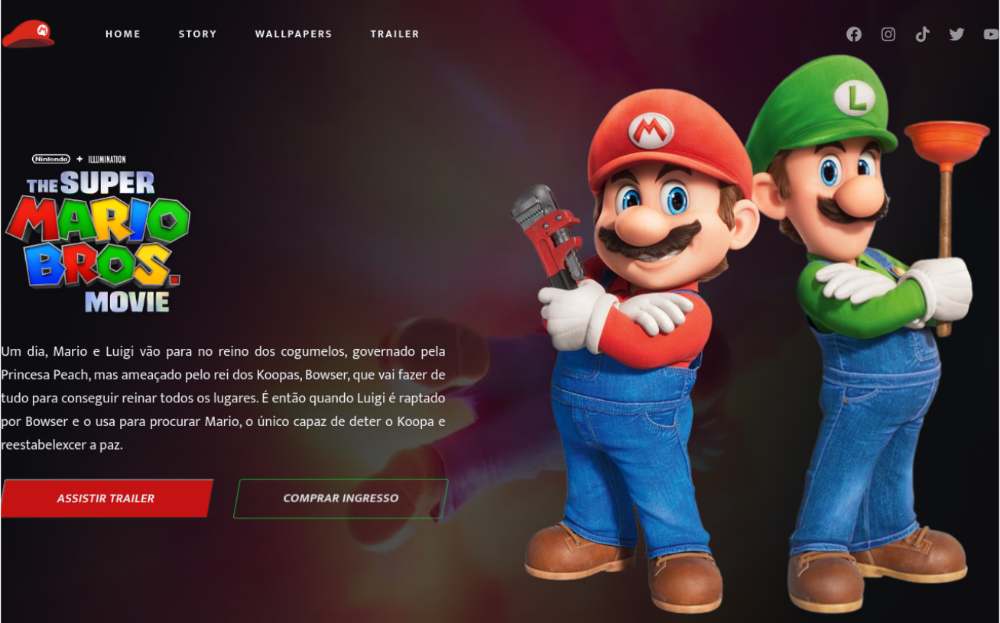

<h1 align="center">
  Super Mario Bros. Movie
</h1>

  <a href="#-projeto">Projeto</a>&nbsp;&nbsp;&nbsp;|&nbsp;&nbsp;&nbsp;
  <a href="#-tecnologias">Tecnologias</a>&nbsp;&nbsp;&nbsp;|&nbsp;&nbsp;&nbsp;
  <a href="#-layout">Layout</a>&nbsp;&nbsp;&nbsp;|&nbsp;&nbsp;&nbsp;

  

## 💻 Projeto

Projeto de site para o filme **Super Mario Bros.** ao usar _HTML_ e _CSS_.

## 🚀 Tecnologias

- HTML
- CSS
- [AOS Animate](https://michalsnik.github.io/aos/)

## 📔 Conhecimentos abordados

- [x] Uso semântico do HTML
- [x] Carregamento de video no background
- [x] Váriaveis do css no `:root`
- [x] Animações com a biblioteca [AOS](https://michalsnik.github.io/aos/)
- [x] Uso do CSS Flexbox
- [x] Efeitos com a propriedade `transform` do css

## 🔖 Layout

Você pode visualizar o projeto através [DESSE LINK](https://charles-mariobros.vercel.app/).